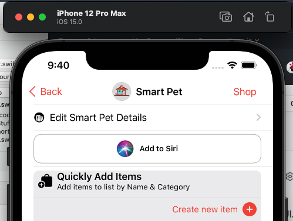
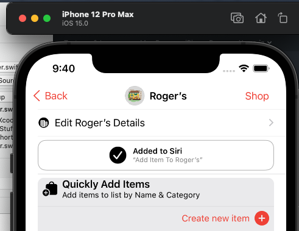

# ``AddToSiriButton``

**AddToSiriButton** provides a wrapper around the `UIKit` **Add To Siri** button so it can be used in a SwiftUI project.

## Overview

**AddToSiriButton** is very easy to use inside a SwiftUI `View`:

```swift
import SwiftUI
import AddToSiriButton

struct StoreProductList: View {

	var isSiriEnabled:Bool {
        #if os(iOS)
        let status = INPreferences.siriAuthorizationStatus()
        
        switch status {
        case .notDetermined:
            return false
        case .restricted:
            return false
        case .denied:
            return false
        case .authorized:
            return true
        @unknown default:
            return false
        }
        #else
        return false
        #endif
    }

	var body: some View {
        VStack {
        	#if os(iOS)
	        if isSiriEnabled {
	            VStack {
	                if let voiceShortcut = ShortcutManager.shared.getAddItemVoiceShortcut(for: Store.tableName) {
	                    SiriButtonView(voiceShortcut: voiceShortcut)
	                } else {
	                    SiriButtonView(intent: ShortcutManager.shared.getIntent(for: .addItemIntent, storeName: store.name))
	                }
	            }
	            .frame(height: 50.0)
	        }
	        #endif
        }
    }
}
```

Would present the following button on iOS if the user hasn't already added a shortcut:



Or it would present this button on iOS if the user had already created a shortcut:



Given the following helper file:

```swift
//
//  ShortcutManager.swift
//  Stuff To Get (iOS)
//
//  Created by Kevin Mullins on 6/24/21.
//  From: https://www.reddit.com/r/SwiftUI/comments/fhh1fw/add_to_siri_button_with_swiftui/
//

import UIKit
import Intents

/**
 Class to manage Siri Voice Shortcuts for the your app. It provides function to load all shortcuts for your app, test to see if a shortcut has already been created and to donate a shortcut to Siri, Shortcuts and Spotlight Search.
 */
@available(iOS 12.0, *)
public final class ShortcutManager {
    
    // MARK: Static Properties
    /// A shared shortcut manager.
    public static let shared = ShortcutManager()
    
    // MARK: Properties
    /// The list of all shortcuts defined for this app.
    var voiceShortcuts:[INVoiceShortcut] = []
    
    // MARK: Initializers
    
    /// Creates a new instant of the object.
    public init() {
        // Initialize
        self.loadAllShortcuts()
    }
    
    // MARK: Functions
    
    /// Loads all predefined shortcuts for the app.
    func loadAllShortcuts() {
        INVoiceShortcutCenter.shared.getAllVoiceShortcuts  { (voiceShortcutsFromCenter, error) in
            guard let voiceShortcutsFromCenter = voiceShortcutsFromCenter else {
                print("Faild to fetch all voice shortcuts: \(String(describing: error))")
                return
            }
            self.voiceShortcuts = voiceShortcutsFromCenter
        }
    }
    
    
    /// Donates the given intent to Siri and Spotlight Search.
    /// - Parameters:
    ///   - intent: The intent to donate.
    ///   - id: The Group ID of the intent to donate.
    func donate(_ intent: INIntent, id: String? = nil) {
        // create a Siri interaction from our intent
        let interaction = INInteraction(intent: intent, response: nil)
        if let id = id {
            interaction.groupIdentifier = id
        }
        
        // donate it to the system
        interaction.donate { error in
            // if there was an error, print it out
            if let error = error {
                print(error)
            }
        }
        
        if let shortcut = INShortcut(intent: intent) {
            let relevantShortcut = INRelevantShortcut(shortcut: shortcut)
            INRelevantShortcutStore.default.setRelevantShortcuts([relevantShortcut]) { error in
                if let error = error {
                    print("Error setting relevant shortcuts: \(error)")
                }
            }
        }
    }
    
    /// Tests to see if the given store already has an **Add Item** shortcut definted for it.
    /// - Parameter store: The store to check for.
    /// - Returns: `true` if the store already has a shortcut, else returns `false`.
    public func hasAddItemIntent(for store:String) -> Bool {
        
        // Search all voice shortcuts
        for voiceShorcut in voiceShortcuts {
            if let intent = voiceShorcut.shortcut.intent as? AddItemIntent {
                if intent.store == store {
                    // Found
                    return true
                }
            }
        }
        
        // Not found
        return false
    }
    
    /// Returns the `INVoiceShortcut` for the given store name if a shortcut has already been defined or returns `nil`.
    /// - Parameter store: The name of the store to search for.
    /// - Returns: The requested `INVoiceShortcut` or `nil` if not found.
    public func getAddItemVoiceShortcut(for store:String) -> INVoiceShortcut? {
        
        // Search all voice shortcuts
        for voiceShorcut in voiceShortcuts {
            if let intent = voiceShorcut.shortcut.intent as? AddItemIntent {
                if intent.store == store {
                    // Found
                    return voiceShorcut
                }
            }
        }
        
        // Not found
        return nil
    }
    
    /// Generates an intent of the requested type with the given optional properties.
    /// - Parameters:
    ///   - shortcut: The type of shortcut intent to generate.
    ///   - storeName: The optional name of the store to generate the intent for.
    ///   - productName: The optional name of the product to generate the intent for.
    ///   - quantity: The optional quantity to generate the intent for.
    /// - Returns: The requested intent or `nil` if the intent cannot be generated.
    public func getIntent(for shortcut:Shortcut, storeName:String = "", productName:String = "", quantity:Int = 1) -> INIntent? {
        
        switch shortcut {
        case .addItemIntent:
            let intent = shortcut.intent as! AddItemIntent
            if !storeName.isEmpty {
                intent.suggestedInvocationPhrase = "Add Item To \(storeName)"
                intent.store = storeName
            }
            if !productName.isEmpty {
                intent.product = productName
            }
            if quantity > 0 {
                intent.quantity = NSNumber.init(value: quantity)
            }
            return intent
        default:
            return nil
        }
    }
    
    // MARK: - Enumerations
    /**
     This enum defines the different types on intent that our app can generate along with properties defining them.
     */
    public enum Shortcut {
        /// The **Add Item** intent.
        case addItemIntent
        
        /// Returns the unique ID of the intent.
        var intentId: String {
            switch self {
            case .addItemIntent: return "addItemIntentShortcut"
            }
        }
        
        /// Returns the `INIntent` for the given type.
        var intent: INIntent {
            var intent: INIntent
            switch self {
            case .addItemIntent:
                intent = AddItemIntent()
            }
            intent.suggestedInvocationPhrase = suggestedInvocationPhrase
            return intent
        }
        
        /// Returns the suggested invocation phrase for the given type.
        var suggestedInvocationPhrase: String {
            switch self {
            case .addItemIntent: return "Add Item"
            }
        }
        
        /// Returns the short title for the given type.
        var shortTitle: String {
            switch self {
            case .addItemIntent: return "Add Item"
            }
        }
        
        /// Donates the given type of Intent to Siri and Spotlight Search.
        func donate() {
            // create a Siri interaction from our intent
            let interaction = INInteraction(intent: self.intent, response: nil)
            interaction.groupIdentifier = intentId
            
            // donate it to the system
            interaction.donate { error in
                // if there was an error, print it out
                if let error = error {
                    print(error)
                }
            }
            
            
            if let shortcut = INShortcut(intent: intent) {
                let relevantShortcut = INRelevantShortcut(shortcut: shortcut)
                INRelevantShortcutStore.default.setRelevantShortcuts([relevantShortcut]) { error in
                    if let error = error {
                        print("Error setting relevant shortcuts: \(error)")
                    }
                }
            }
            
        }
    }
}

```

> `AddItemIntent` is a **Custom Intent** added to a Swift Project in the code above, how to create and implement an intent is beyond the scope of the document. Please see Apple's documentation for assistance.
